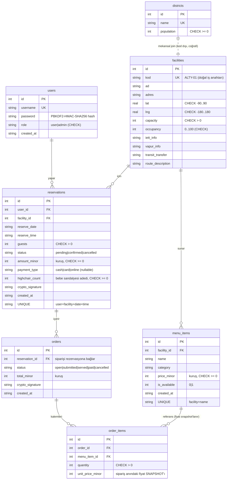

# v_2 Varlık-İlişki (ER) Diyagramı

Bu diyagram v_2 hedef veri modelini gösterir. **Düz çizgili tablolar** uygulanmış durumdadır
(migration v1 + v2). **Kesikli/planlanan** tablolar `daily_stats`, `ispark_status`, `audit_log`
sonraki fazlarda kendi migration'larıyla eklenecek (bkz. ADR-001) — burada şemanın önden
tasarlandığını göstermek için yer alıyorlar.

Para değerleri her yerde **tam sayı kuruş** (`*_minor`) olarak tutulur (float yuvarlama
hatasından kaçınmak için — bkz. ADR-001).



## Planlanan tablolar (sonraki fazlar — henüz migration yok)

```mermaid
erDiagram
    facilities ||--o| ispark_status : "otopark durumu (Faz v2-03)"
    facilities ||--o{ daily_stats : "günlük özet (Faz v2-04)"
    users ||--o{ audit_log : "işlem kaydı (Faz v2-07)"

    ispark_status {
        int facility_id PK_FK
        int capacity
        int occupied "eşzamanlı düşülür (Faz 3: yarış koşulu)"
        string updated_at
    }
    daily_stats {
        string date PK "rollup anahtarı"
        int facility_id PK_FK
        int revenue_minor "türetilmiş: siparişlerden"
        int guest_count
        int highchair_count
        int order_count
    }
    audit_log {
        int id PK
        int actor_user_id FK
        string action
        string entity_type
        int entity_id
        string detail
        string created_at
    }
```

> `daily_stats` **türetilmiş veri**dir (siparişlerden hesaplanır). v1'de canlı sorgu ile
> başlanacak, sonra bu rollup tablosu eklenip ikisi benchmark edilecek (DDIA Böl. 3, OLTP/OLAP).
