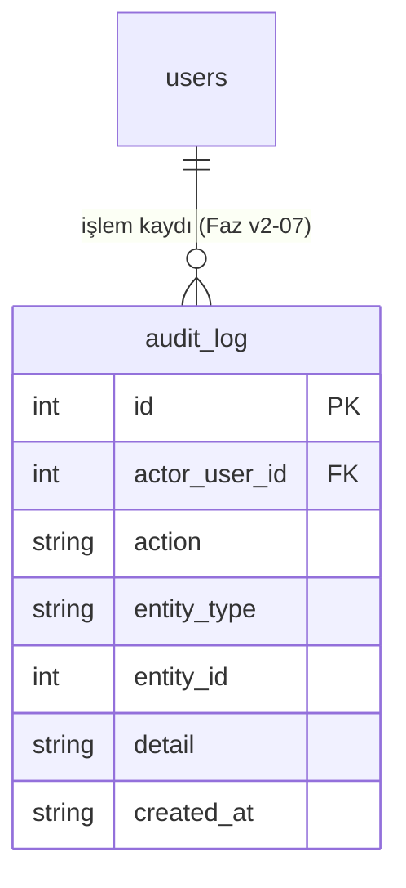

# v_2 Varlık-İlişki (ER) Diyagramı

Bu diyagram v_2 hedef veri modelini gösterir. **Uygulanmış tablolar** (migration v1–v4):
users, facilities, reservations, menu_items, orders, order_items, districts, **ispark_status**
(v3), **daily_stats** (v4 rollup). **Planlanan** tablo `audit_log` (v2-07) kendi migration'ıyla
eklenecek — şemanın önden tasarlandığını göstermek için burada.

Para değerleri her yerde **tam sayı kuruş** (`*_minor`) olarak tutulur (float yuvarlama
hatasından kaçınmak için — bkz. ADR-001).

```mermaid
erDiagram
    users ||--o{ reservations : "yapar"
    facilities ||--o{ reservations : "için"
    facilities ||--o{ menu_items : "sunar"
    facilities ||--o| ispark_status : "otopark (atomik yer kapma)"
    reservations ||--o{ orders : "içerir"
    orders ||--o{ order_items : "kalemleri"
    menu_items ||--o{ order_items : "referans (fiyat snapshot'lanır)"
    districts ||..|| facilities : "mekansal join (kod dışı, coğrafi)"

    users {
        int id PK
        string username UK
        string password "PBKDF2-HMAC-SHA256 hash"
        string role "user|admin (CHECK)"
        string created_at
    }
    facilities {
        int id PK
        string kod UK "ALTY-01 (doğal iş anahtarı)"
        string ad
        string adres
        real lat "CHECK -90..90"
        real lng "CHECK -180..180"
        int capacity "CHECK > 0"
        int occupancy "0..100 (CHECK)"
        string iett_info
        string vapur_info
        string transit_transfer
        string route_description
    }
    reservations {
        int id PK
        int user_id FK
        int facility_id FK
        string reserve_date
        string reserve_time
        int guests "CHECK > 0"
        string status "pending|confirmed|cancelled"
        int amount_minor "kuruş, CHECK >= 0"
        string payment_type "cash|card|online (nullable)"
        int highchair_count "bebe sandalyesi adedi, CHECK >= 0"
        string crypto_signature
        string created_at
        string UNIQUE "user+facility+date+time"
    }
    menu_items {
        int id PK
        int facility_id FK
        string name
        string category
        int price_minor "kuruş, CHECK >= 0"
        int is_available "0|1"
        string created_at
        string UNIQUE "facility+name"
    }
    orders {
        int id PK
        int reservation_id FK "siparişi rezervasyona bağlar"
        string status "open|submitted|served|paid|cancelled"
        int total_minor "kuruş"
        string crypto_signature
        string created_at
    }
    order_items {
        int id PK
        int order_id FK
        int menu_item_id FK
        int quantity "CHECK > 0"
        int unit_price_minor "sipariş anındaki fiyat SNAPSHOT'ı"
    }
    districts {
        int id PK
        string name UK
        int population "CHECK >= 0"
    }
    ispark_status {
        int facility_id PK_FK
        int capacity "CHECK > 0"
        int occupied "CHECK 0..capacity (overbook DB'de imkansız)"
        string updated_at
    }
```

## Uygulanan rollup: daily_stats (v4)

```mermaid
erDiagram
    facilities ||--o{ daily_stats : "günlük×tesis özet (türetilmiş)"
    daily_stats {
        string stat_date PK "rollup anahtarı"
        int facility_id PK_FK
        int revenue_minor "türetilmiş: rezervasyon+sipariş"
        int reservation_count
        int guest_count
        int highchair_count
        int cancelled_count
        int order_count
    }
```

> `daily_stats` **türetilmiş veri**dir (kaynaktan rebuild edilir). Analitik: v1 canlı sorgu,
> sonra bu rollup + benchmark (~178× hızlanma). Bkz. ADR-004 (DDIA Böl. 3, OLTP/OLAP; Böl. 11).

## Planlanan tablo (sonraki faz — henüz migration yok)


